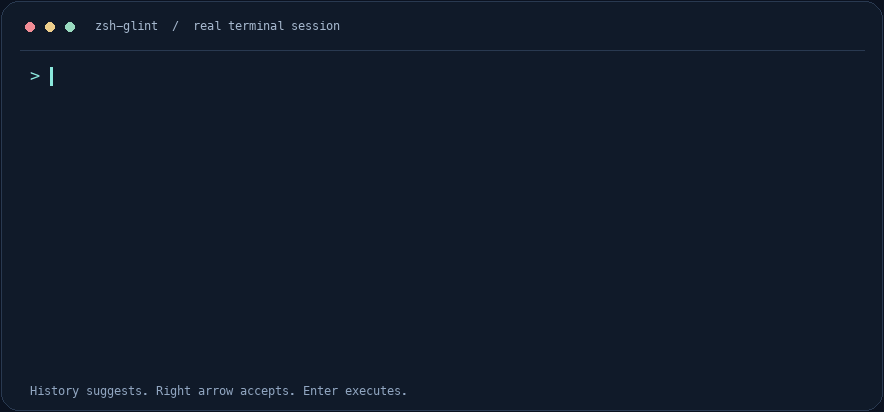

[](https://github.com/carefreelove/zsh-glint/actions/workflows/ci.yml)
[](https://github.com/carefreelove/zsh-glint/releases)
[](docs/guide.md#requirements)
[](LICENSE)

**English** · [简体中文](README.zh-CN.md)

History suggestions that stay out of your way. Type a prefix, accept the gray suggestion with **→**, and use **Tab** for Zsh's native path and argument completion. Runs offline, with no extra plugin runtime.



[Still image](docs/assets/demo.png) · [Raw terminal recording](docs/assets/demo.cast) · [Recording method](CONTRIBUTING.md#recording-the-demo)

## Install in a minute

Requires **Zsh 5.9+** on macOS or Linux.

```sh
git clone https://github.com/carefreelove/zsh-glint.git
cd zsh-glint
zsh scripts/install.zsh
```

Open a new Zsh session. The installer backs up your `.zshrc` and adds one managed block. **Keep the clone directory in place.** For custom `ZDOTDIR`, Oh My Zsh, or manual setup, see the [installation guide](docs/guide.md#installation).

To try it without changing startup configuration, run this from the clone in an existing Zsh session:

```zsh
source ./zsh-glint.plugin.zsh
```

## Small surface. Useful defaults.

| You do | glint does |
| --- | --- |
| Type a known command prefix | Suggests the most recent matching history entry in gray |
| Press → at the end of the line | Inserts the suggestion; **Enter still controls execution** |
| Press → inside a line | Moves the cursor normally |
| Press Tab | Uses Zsh's native file, directory, and argument completion |
| Run `zsh-glint doctor` | Checks configuration, hooks, widget ownership, and completion permissions |
| Run `zsh-glint off` / `on` | Pauses or resumes suggestions |

Emacs and Vi insert modes are covered by real terminal tests. Customize color, length limits, and shortcuts in the [configuration guide](docs/guide.md#configuration).

## Measured, with the method included

The v0.2 matcher uses native Zsh array search and reuses unchanged queries. On the recorded macOS arm64 / Zsh 5.9 benchmark, a **cold miss across 1,000 synthetic candidates** fell from **2.21 ms to 0.10 ms median**. Results depend on hardware, workload, and machine load; these numbers exclude terminal rendering and shell startup.

[Method and full results](docs/performance.md) · [Before](docs/benchmark-before.json) · [After](docs/benchmark-after.json)

## Local, predictable, reversible

- Suggestions use history already loaded by your shell. No network requests or extra history files.
- Inline suggestions come **only from history**. Path and argument completion use Tab. No AI or fuzzy search.
- `doctor` reports counts and checks, without printing command history or changing configuration. Exit code `0` means no warnings; `1` means something needs attention.
- Standard `compinit` permission checks remain enabled. Other plugins that own `POSTDISPLAY` may conflict; use one history-suggestion provider at a time.

Uninstall the managed configuration, then open a new Zsh session:

```sh
zsh scripts/uninstall.zsh
```

See [history and privacy](docs/guide.md#history-and-privacy), [compatibility](docs/compatibility.md), and [upgrading from terminal-completion](docs/guide.md#upgrading-from-the-previous-name).

## Project notes

[User guide](docs/guide.md) · [Changelog](CHANGELOG.md) · [Contributing](CONTRIBUTING.md) · [Releases](https://github.com/carefreelove/zsh-glint/releases) · [MIT license](LICENSE)

Run `python3 -m unittest discover -s tests -v` to test. CI covers macOS and Linux, real PTY behavior, installer migration, diagnostics, and plugin loading order.
